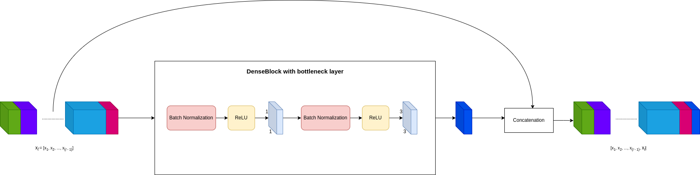
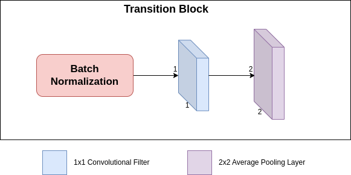

# [DenseNet]

## Overview
This repository contains the implementation of DenseNet. Below you will find detailed information and resources related to this architecture.

## Detailed Explanation
For a comprehensive understanding of the paper and its contributions, please refer to the [detailed blog post](https://gvdmnni.notion.site/DenseNet-bd578f8d65b0490abfec9c5491ec1de4).

## Major Contributions
The major contributions of the paper include:
- Dense connectivity: Direct connections between any two layers in a feed-forward fashion, enabling feature reuse throughout the network and reducing redundancy.
- Alleviating vanishing gradients: Each layer has direct access to the gradients from the loss function and original input, providing implicit deep supervision.
- Reduced parameter count: DenseNets require fewer parameters than traditional CNNs as there is no need to re-learn redundant feature maps.
- Improved information and gradient flow: Enables training of very deep networks in an efficient and easy to optimize manner.

## Architecture Scheme
Below a schematic representation of the modules that are used in the architecture:
*Dense Block with bottleneck*

*Transition Block*

## Reproduced Results (TBD)
The following results were reproduced as per the methodology described in the paper:
- Result 1: [Description and value]
- Result 2: [Description and value]
- Result 3: [Description and value]
- ...

## References
- [Original Paper](https://arxiv.org/abs/1608.06993)
- [Detailed Blog Post](https://www.notion.so/gvdmnni/DenseNet-bd578f8d65b0490abfec9c5491ec1de4?pm=c)
