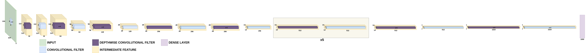
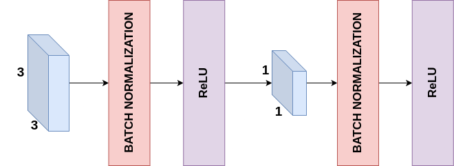

# [MobileNet]

## Overview
This repository contains the implementation of MobileNet. Below you will find detailed information and resources related to this architecture.

## Detailed Explanation
For a comprehensive understanding of the paper and its contributions, please refer to the [detailed blog post](https://gvdmnni.notion.site/MobileNets-387efa72839b4b0fa980cfc858c5052f).

## Major Contributions
The major contributions of the paper include:
1. Introduction of the MobileNet architecture, which uses depthwise separable convolutions as its core building block.
2. Proposal of two hyperparameters - width multiplier and resolution multiplier - that allow for easy adjustment of the model size and computational requirements.
3. Extensive experiments demonstrating the effectiveness of MobileNets across various tasks and applications, including image classification, object detection, and face attribute detection.
4. Comparison with other popular models, showing that MobileNets can achieve comparable accuracy with significantly reduced computational cost and model size.

## Architecture Scheme
Below a schematic representation of the MobileNet architecture:

Below a schematic representation of the DepthWise Convolution modules that are used in the architecture:

## Reproduced Results (TBD)
The following results were reproduced as per the methodology described in the paper:
- Result 1: [Description and value]
- Result 2: [Description and value]
- Result 3: [Description and value]
- ...

## References
- [Original Paper](https://arxiv.org/abs/1704.04861)
- [Detailed Blog Post](https://gvdmnni.notion.site/MobileNets-387efa72839b4b0fa980cfc858c5052f)
