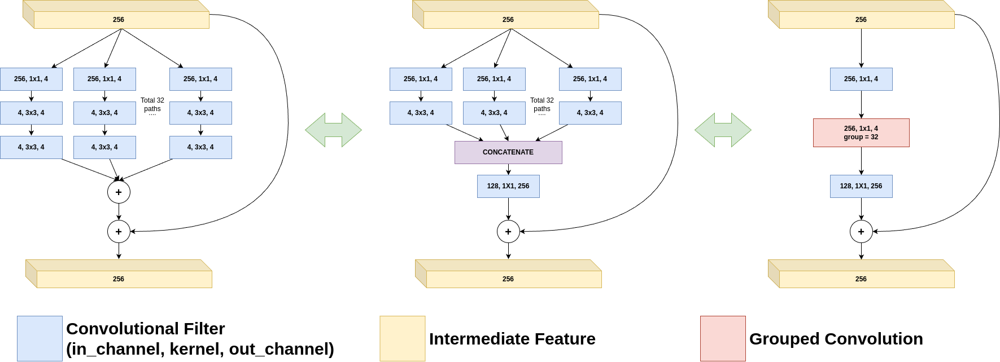

# [ResNeXt]

## Overview
This repository contains the implementation of ResNeXt. Below you will find detailed information and resources related to this architecture.

## Detailed Explanation
For a comprehensive understanding of the paper and its contributions, please refer to the [detailed blog post](https://gvdmnni.notion.site/ResNext-05bd5cb9ae0a40fb811746f5a4331f65?pvs=4).

## Major Contributions
The major contributions of the paper include:
1. ResNeXt: A homogeneous, multi-branch architecture that aggregates a set of transformations with the same topology. This design is easy to implement and scale up.
2. Cardinality: A new dimension that controls the number of transformations in ResNeXt. Experiments show that increasing cardinality is more effective than going deeper or wider for improving accuracy while maintaining model complexity.
3. Improved accuracy: ResNeXt achieves better accuracy than previous state-of-the-art models on the ImageNet-1K dataset while having lower complexity. It also performs well on the CIFAR datasets and COCO object detection task.

## Architecture Scheme
Below a schematic representation of the ResNext modules that are used in the architecture:

## Reproduced Results (TBD)
The following results were reproduced as per the methodology described in the paper:
- Result 1: [Description and value]
- Result 2: [Description and value]
- Result 3: [Description and value]
- ...

## References
- [Original Paper](https://arxiv.org/abs/1611.05431)
- [Detailed Blog Post](https://gvdmnni.notion.site/ResNext-05bd5cb9ae0a40fb811746f5a4331f65?pvs=4)
