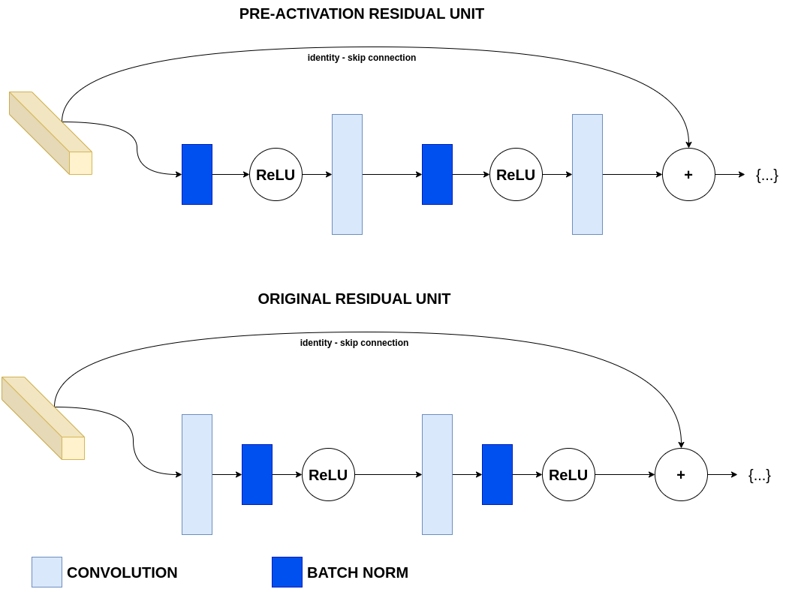

# [Residual Attention Network]

## Overview
This repository contains the implementation of Residual Attention Network. Below you will find detailed information and resources related to this architecture.

## Detailed Explanation
For a comprehensive understanding of the paper and its contributions, please refer to the [detailed blog post](https://gvdmnni.notion.site/Residual-Attention-Network-54828e44946a4306b774610ceb251b26?pvs=4).

## Major Contributions
The major contributions of the paper include:
1. Proposing a novel attention mechanism that can be integrated into state-of-the-art feedforward architectures
2. Introducing the Attention Module, which generates attention-aware features via a bottom-up top-down structure
3. Developing attention residual learning to handle the optimization difficulties caused by stacking Attention Modules
4. Demonstrating state-of-the-art performance on CIFAR-10, CIFAR-100, and ImageNet while being computationally efficient

## Architecture Scheme
Below a schematic representation of the Residual Attention Network units that are used in the architecture:
**Residual Attention Module**
**Residual Unit**
**Soft Masking Branch**

## Reproduced Results (TBD)
The following results were reproduced as per the methodology described in the paper:
- Result 1: [Description and value]
- Result 2: [Description and value]
- Result 3: [Description and value]
- ...

## References
- [Original Paper](https://arxiv.org/abs/1704.06904)
- [Detailed Blog Post](https://gvdmnni.notion.site/Residual-Attention-Network-54828e44946a4306b774610ceb251b26?pvs=4)
