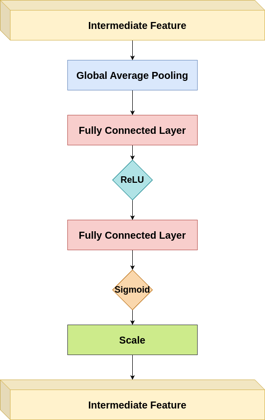

# [SENet]

## Overview
This repository contains the implementation of SENet. Below you will find detailed information and resources related to this architecture.

## Detailed Explanation
For a comprehensive understanding of the paper and its contributions, please refer to the [detailed blog post](https://gvdmnni.notion.site/SENet-4af63658ec1f48649378e864c2232231?pvs=4).

## Major Contributions
The major contributions of the paper include:
1. Introduction of the Squeeze-and-Excitation (SE) block, a lightweight yet effective module for modeling channel-wise relationships in CNN features.
2. Development of the SENet architecture, which can be created by stacking multiple SE blocks.
3. Demonstration of significant performance improvements when integrating SE blocks into existing state-of-the-art architectures like ResNet, Inception, and MobileNet.
4. Extensive experimentation showing the effectiveness of SENets across various datasets and tasks, including image classification, scene classification, and object detection.
5. Winning the ILSVRC 2017 classification competition, showcasing the practical impact of the proposed method.

## Architecture Scheme
Below a schematic representation of the SENet block that is the main contribution of this paper

## Reproduced Results (TBD)
The following results were reproduced as per the methodology described in the paper:
- Result 1: [Description and value]
- Result 2: [Description and value]
- Result 3: [Description and value]
- ...

## References
- [Original Paper](https://arxiv.org/abs/1602.07360)
- [Detailed Blog Post](https://gvdmnni.notion.site/SENet-4af63658ec1f48649378e864c2232231?pvs=4)
