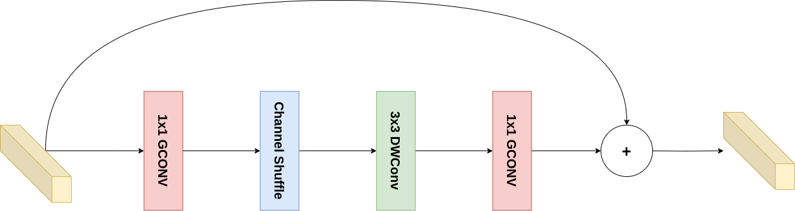
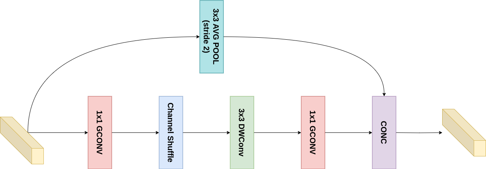

# [ShuffleNet]

## Overview
This repository contains the implementation of ShuffleNet. Below you will find detailed information and resources related to this architecture.

## Detailed Explanation
For a comprehensive understanding of the paper and its contributions, please refer to the [detailed blog post](https://gvdmnni.notion.site/ShuffleNet-97075c040be24950b7d1ec244a00ed4e?pvs=4).

## Major Contributions
The major contributions of the paper include:
1. Pointwise Group Convolutions: The authors introduce the use of grouped convolutions for 1x1 layers, significantly reducing computational cost.
2. Channel Shuffle Operation: To overcome the limitations of grouped convolutions, they propose a channel shuffle operation that enables information flow across feature channels from different groups.
3. ShuffleNet Unit: Building on these innovations, they design a new basic unit for CNN architectures that is both highly efficient and maintains strong performance.
4. Comprehensive Experiments: The paper presents extensive comparisons with other architectures across various computational complexities, demonstrating ShuffleNet's superior performance.
5. Real-world Performance: Unlike many papers that focus solely on theoretical complexity, the authors evaluate actual inference time on mobile devices, providing practical insights for deployment.
## Architecture Scheme
Below a schematic representation of the ShuffleNet units that are used in the architecture:
**ShuffleNet Unit without Stride**
**ShuffleNet Unit with Stride**

## Reproduced Results (TBD)
The following results were reproduced as per the methodology described in the paper:
- Result 1: [Description and value]
- Result 2: [Description and value]
- Result 3: [Description and value]
- ...

## References
- [Original Paper](https://arxiv.org/abs/1707.01083)
- [Detailed Blog Post](https://gvdmnni.notion.site/ShuffleNet-97075c040be24950b7d1ec244a00ed4e?pvs=4)
