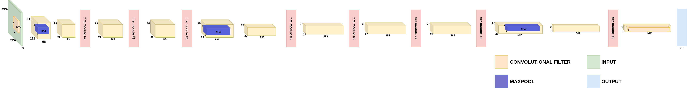
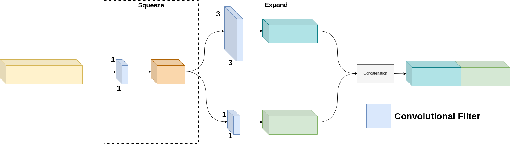

# [SqueezeNet]

## Overview
This repository contains the implementation of SqueezeNet. Below you will find detailed information and resources related to this architecture.

## Detailed Explanation
For a comprehensive understanding of the paper and its contributions, please refer to the [detailed blog post](https://gvdmnni.notion.site/SqueezeNet-6872b7d0b1b849c5956de2927a880105?pvs=4).

## Major Contributions
The major contributions of the paper include:
- Introduction of design principles for efficiently scaling up CNNs, focusing on factorized convolutions and dimension reduction.
- Development of Inception-v2 and Inception-v3 architectures, which significantly improve upon the original GoogLeNet design.
- Proposal of label smoothing as a regularization technique to prevent the network from becoming too confident in its predictions.
- Investigation of the impact of input resolution on network performance, showing that lower resolution inputs can still achieve competitive results when the network is properly adapted.
- Achievement of state-of-the-art performance on the ILSVRC 2012 classification benchmark, with a substantial reduction in computational cost compared to other top-performing networks.

## Architecture Scheme
Below a schematic representation of the SqueezeNet architecture:

Below a schematic representation of the FIRE modules that are used in the architecture:

## Reproduced Results (TBD)
The following results were reproduced as per the methodology described in the paper:
- Result 1: [Description and value]
- Result 2: [Description and value]
- Result 3: [Description and value]
- ...

## References
- [Original Paper](https://arxiv.org/abs/1602.07360)
- [Detailed Blog Post](https://gvdmnni.notion.site/SqueezeNet-6872b7d0b1b849c5956de2927a880105?pvs=4)
