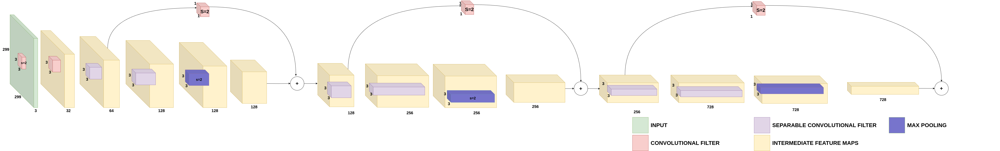
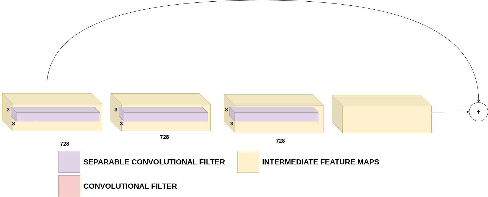
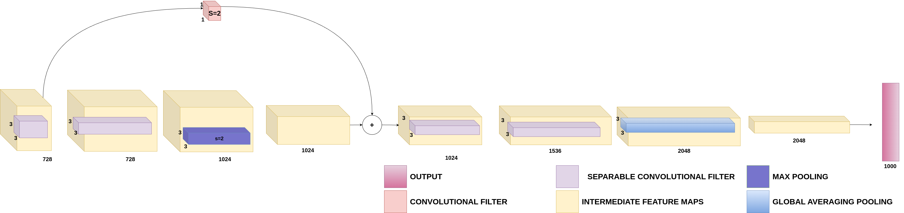

# [Xception]

## Overview
This repository contains the implementation of Xception. Below you will find detailed information and resources related to this architecture.

## Detailed Explanation
For a comprehensive understanding of the paper and its contributions, please refer to the [detailed blog post](https://gvdmnni.notion.site/Xception-d96a577832534a4da9e87272edf25d48?pvs=4).

## Major Contributions
The major contributions of the paper include:
## 

- Xception is based on the hypothesis that cross-channel correlations and spatial correlations in convolutional networks can be entirely decoupled.
- It maps all spatial correlations with a single convolutional layer and performs 1x1 depthwise convolutions to capture cross-channel correlations.
- This is mathematically equivalent to performing standard convolutions but allows the network to separately map spatial and depthwise correlations.
- Xception uses residual connections, making it easy to define and modify the architecture.
- Experiments show that Xception outperforms Inception V3 on large datasets like JFT while using a similar number of parameters.

## Architecture Scheme
Below a schematic representation of the modules that are used in the architecture:
*Figure: Xception Entry Flow*

*Figure: Xception Middle Flow*

*Figure: Xception Exit Flow*

## Reproduced Results (TBD)
The following results were reproduced as per the methodology described in the paper:
- Result 1: [Description and value]
- Result 2: [Description and value]
- Result 3: [Description and value]
- ...

## References
- [Original Paper](https://arxiv.org/abs/1512.00567)
- [Detailed Blog Post](https://gvdmnni.notion.site/Xception-d96a577832534a4da9e87272edf25d48?pvs=4)
