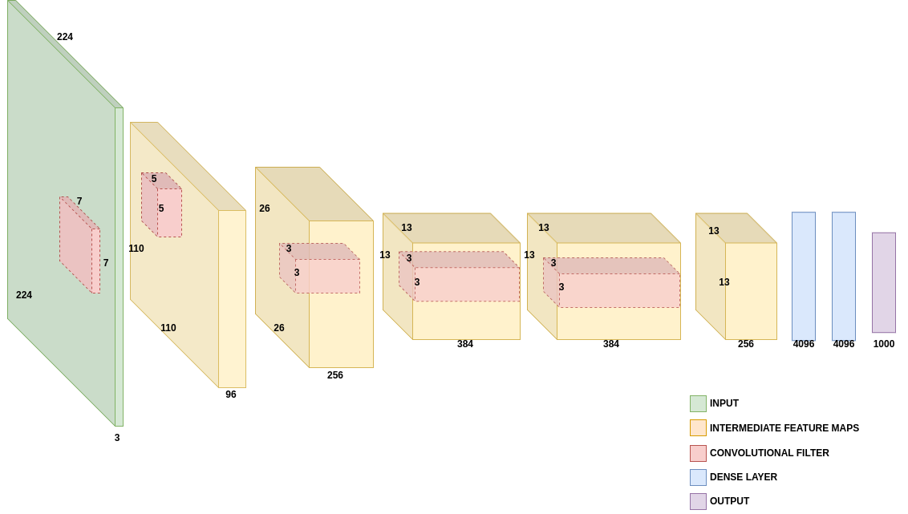

# [ZFNet]

## Overview
This repository contains the implementation of ZFNet. Below you will find detailed information and resources related to this architecture.

## Detailed Explanation
For a comprehensive understanding of the paper and its contributions, please refer to the [detailed blog post](https://www.notion.so/gvdmnni/ZFNet-0eb644d269a3465cb8a900ebddbefb7c).

## Major Contributions
The major contributions of the paper include:
- Development of a novel visualization technique to analyze convolutional networks.
- Enhanced understanding of the inner workings and feature activations within CNNs.
- Insights into the significance of deeper architectures for improved performance.
- Implementation of smaller kernel sizes for capturing finer-grained patterns.
- Pioneering use of transfer learning to generalize models across different datasets

## Architecture Scheme
Below is a schematic representation of the architecture:

## Reproduced Results (TBD)
The following results were reproduced as per the methodology described in the paper:
- Result 1: [Description and value]
- Result 2: [Description and value]
- Result 3: [Description and value]
- ...

## References
- [Original Paper](https://arxiv.org/pdf/1311.2901)
- [Detailed Blog Post](https://www.notion.so/gvdmnni/ZFNet-0eb644d269a3465cb8a900ebddbefb7c)
